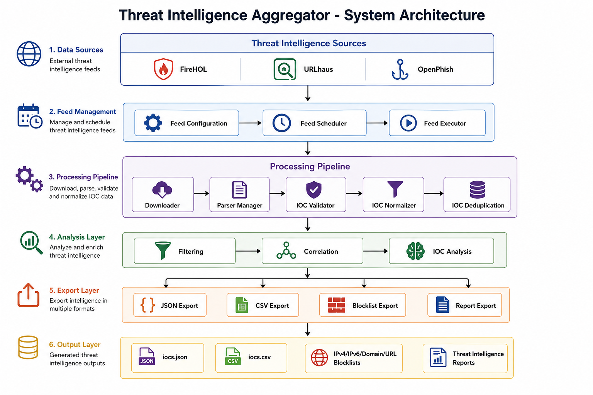
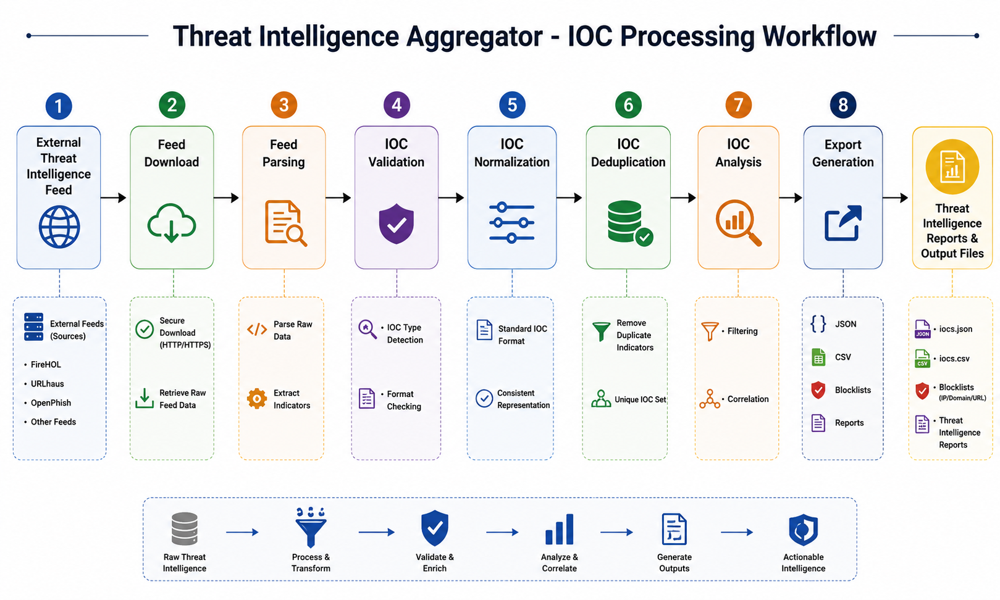

# Threat Intelligence Aggregator

A production-oriented Python application for collecting, processing, analyzing, and exporting cyber threat intelligence indicators (IOCs).

The system aggregates threat intelligence feeds, validates and normalizes indicators, removes duplicates, performs analysis, and generates multiple intelligence output formats.

---

## Overview

Threat Intelligence Aggregator automates the ingestion and processing of external threat intelligence feeds.

The application supports multiple feed formats and transforms raw intelligence data into structured, normalized IOC datasets suitable for security analysis, monitoring, and defensive workflows.

### Core capabilities

* Threat intelligence feed ingestion
* Multi-format parsing
* IOC validation and normalization
* Duplicate indicator removal
* Feed scheduling and execution management
* IOC filtering and analysis
* Multiple export formats
* Execution reporting
* CLI-based execution
* Automated testing

---

# Features

## Feed Processing

Supported:

* TXT feeds
* CSV feeds
* JSON feeds

Implemented feed workflow:

```
Feed Source
     |
     v
Downloader
     |
     v
Parser
     |
     v
IOC Validation
     |
     v
Normalization
     |
     v
Deduplication
     |
     v
Analysis
     |
     v
Export
```

---

# Supported IOC Types

The system validates and processes:

* IPv4 addresses
* IPv6 addresses
* IPv4 CIDR ranges
* Domains
* URLs
* MD5 hashes
* SHA1 hashes
* SHA256 hashes

---

# Architecture

The project follows:

* Clean Architecture principles
* SOLID design principles
* Dependency Injection
* Modular components
* Separation of responsibilities

High-level architecture:

```
                 Feed Sources
                      |
                      v
              Feed Management
                      |
                      v
               Feed Scheduler
                      |
                      v
                Feed Executor
                      |
                      v
              Processing Pipeline
                      |
        --------------------------------
        |              |               |
     Parser       Validator       Normalizer
        |
        v
   Deduplication
        |
        v
    Analysis Layer
        |
        v
      Exporters
        |
        v
   Reports / Output
```
## Architecture Diagram



## IOC Processing Workflow



---

# Project Structure

```
Threat-Intelligence-Aggregator/

├── analytics/
│   └── IOC analysis components

├── blocklist/
│   └── Blocklist generation

├── configs/
│   └── Feed configuration files

├── correlation/
│   └── IOC correlation features

├── deduplication/
│   └── IOC duplicate handling

├── downloader/
│   └── Feed download functionality

├── exporter/
│   └── Output exporters

├── feeds/
│   └── Feed management components

├── filters/
│   └── IOC filtering

├── normalizer/
│   └── IOC normalization

├── parsers/
│   └── Feed parsers

├── pipeline/
│   └── Processing pipeline

├── reports/
│   └── Report generation

├── src/
│   └── Feed execution architecture

├── tests/
│   └── Unit and integration tests

├── validators/
│   └── IOC validation

├── output/
│   └── Generated intelligence files

├── main.py
│   └── CLI entry point

├── config.py
│   └── Application configuration
```

---

# Installation

## Clone Repository

```bash
git clone <repository-url>
cd Threat-Intelligence-Aggregator
```

## Create Virtual Environment

```bash
python -m venv .venv
```

Activate:

Windows:

```bash
.venv\Scripts\activate
```

Linux/macOS:

```bash
source .venv/bin/activate
```

---

## Install Dependencies

Production:

```bash
pip install -r requirements.txt
```

Development:

```bash
pip install -r requirements-dev.txt
```

---

# Configuration

Feed configuration files are stored in:

```
configs/
```

Example execution:

```bash
python main.py --run --config configs/feeds.yaml
```

The configuration defines:

* Feed name
* Feed URL
* Parser type
* Enabled status

---

# CLI Usage

## Run Aggregation

```bash
python main.py --run --config configs/feeds.yaml
```

The application will:

1. Load configured feeds
2. Execute enabled feeds
3. Process indicators
4. Normalize and deduplicate data
5. Generate exports
6. Produce execution reports

---

## Error Handling

The CLI handles:

* Missing configuration files
* Invalid configurations
* Feed failures
* Export failures

Example:

```
ERROR --config must be supplied when using --run
```

---

# Export Formats

Generated outputs include:

## IOC Data

```
iocs.json
iocs.csv
```

## Blocklists

```
ipv4_blocklist.txt
ipv6_blocklist.txt
domain_blocklist.txt
url_blocklist.txt
md5_blocklist.txt
sha1_blocklist.txt
sha256_blocklist.txt
```

## Reports

```
correlation_report.csv
threat_intelligence_report.txt
```

---

# Testing

The project uses pytest.

Run:

```bash
python -m pytest
```

Current status:

```
76 passed
```

Testing covers:

* Feed processing
* Parsing
* Validation
* Normalization
* Deduplication
* Scheduler execution
* CLI behavior
* Export functionality

---

# Current Supported Intelligence Sources

Examples:

* FireHOL IP blocklists
* URLhaus feeds
* OpenPhish feeds

---

# Future Improvements

Potential enhancements:

* Database storage layer
* Threat intelligence API integration
* STIX/TAXII support
* Web dashboard
* Automated IOC reputation scoring
* Container deployment
* CI/CD pipeline integration

---

# License

This project is licensed under the MIT License.
